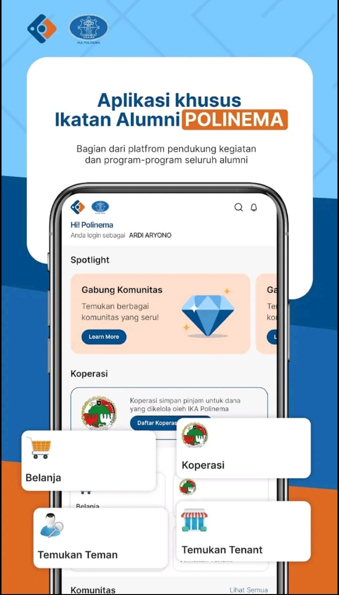
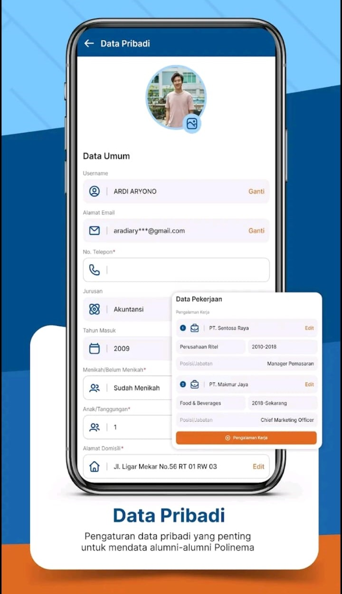
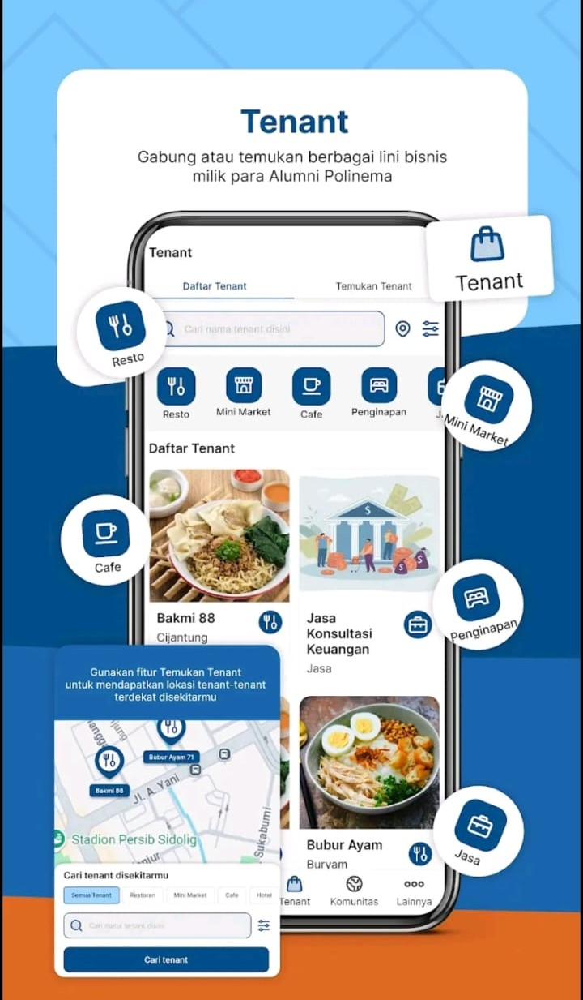
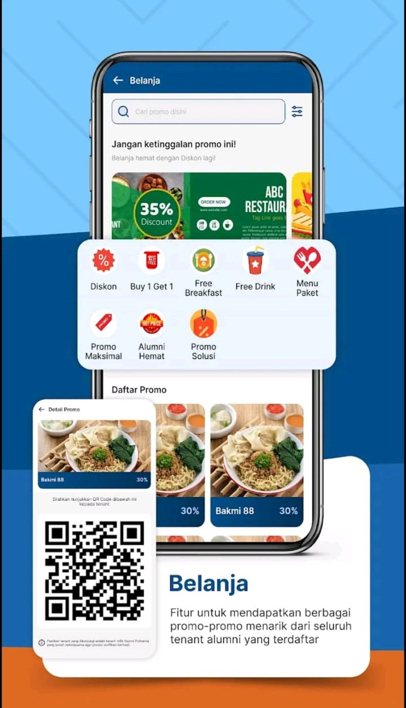

# HI Polinema REST API

<p align="center">
  
</p>

## 📌 Deskripsi Proyek

**HI Polinema REST API** adalah backend service berbasis **Laravel** yang digunakan sebagai penyedia data (RESTful API) untuk aplikasi **HI Polinema**. API ini bertugas menangani proses bisnis utama seperti autentikasi, manajemen data, serta komunikasi antara aplikasi frontend/mobile dengan database.

Proyek ini dikembangkan dengan arsitektur API-centric sehingga dapat digunakan oleh berbagai client (Web, Mobile, atau sistem lain).



---

## ✨ Fitur Utama Aplikasi

Aplikasi **HI Polinema** menyediakan berbagai fitur utama yang terintegrasi dengan REST API ini untuk mendukung interaksi, aktivitas, dan kebutuhan pengguna di lingkungan Polinema.

### 👤 Profile

Pengguna dapat mengelola informasi profil pribadi seperti data diri, foto profil, serta pengaturan akun yang terhubung langsung dengan sistem backend.



### 🤝 Teman

Fitur pertemanan memungkinkan pengguna untuk saling terhubung, menambah teman, melihat daftar teman, serta membangun relasi antar pengguna di dalam aplikasi.


### 🛒 Belanja

Aplikasi menyediakan fitur belanja yang memungkinkan pengguna melihat produk, melakukan transaksi, serta memantau status pesanan yang dikelola melalui REST API.



### 🏪 Tenant

Fitur tenant digunakan untuk menampilkan dan mengelola data tenant (penjual) yang ada di lingkungan Polinema, termasuk informasi produk dan aktivitas penjualan.



### 👥 Komunitas

Pengguna dapat bergabung ke dalam komunitas, berinteraksi, serta mengikuti berbagai aktivitas atau informasi yang dibagikan dalam komunitas tersebut.


---

## 🚀 Teknologi yang Digunakan

- **Framework**: Laravel
- **Bahasa**: PHP
- **Database**: PostgreSQL
- **Autentikasi**: JWT
- **API Documentation**: Swagger (L5 Swagger)
- **Dependency Manager**: Composer

---

## 🔑 Autentikasi

Sebagian besar endpoint menggunakan **Bearer Token (JWT)**.

Contoh header request:

```
Authorization: Bearer <your_token_here>
```

---

## 📖 Dokumentasi API (Swagger)

Dokumentasi API tersedia melalui Swagger UI setelah aplikasi dijalankan.

```bash
php artisan serve
php artisan l5-swagger:generate
```

Akses Swagger di:

```
http://127.0.0.1:8000/api/documentation
```

---

## ⚙️ Instalasi & Menjalankan Proyek

### 1️⃣ Clone Repository

```bash
git clone <repository-url>
cd hi-polinema-api
```

### 2️⃣ Install Dependency

```bash
composer install
```

### 3️⃣ Konfigurasi Environment

Salin file `.env.example` menjadi `.env` lalu sesuaikan konfigurasi database:

```bash
cp .env.example .env
php artisan key:generate
```

### 4️⃣ Migrasi Database

```bash
php artisan migrate
```

### 5️⃣ Jalankan Server

```bash
php artisan serve
```

---

## 🧪 Testing (Opsional)

```bash
php artisan test
```

---

## 📌 Catatan Pengembangan

- Proyek ini **fokus sebagai REST API**, tidak menyediakan tampilan frontend.
- Disarankan menggunakan **Postman / Swagger UI** untuk testing endpoint.
- Struktur dan dokumentasi dibuat agar mudah dikembangkan oleh tim.

---

## 👨‍💻 Kontributor

- **Backend Developer**: Tim HI Polinema

---

## 📄 Lisensi

Proyek ini bersifat **internal** dan digunakan untuk kebutuhan pengembangan aplikasi **HI Polinema**.

Untuk melihat fitur lengkap dan pengalaman penggunaan secara langsung, silakan kunjungi Google Play Store dan cari aplikasi HI Polinema.

---

✨ _Happy Coding & API Development!_
